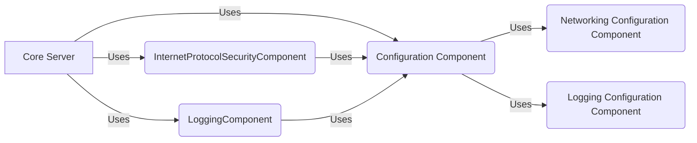

# BorealCore Server!
BorealCoreServer is a simple, asynchronous, multithreading and **socket based** server library.

# How to start?
Code snippet.

    // Received request handler.
    CoreServer.Server.receivedRequestEvent += ProcessReceivedRequest;
    // Server start.
    CoreServer.Server.Instance.Start();

You may process a request using an event handler like ProcessReceivedRequest. BorealCoreServer is a core library so, you must to manage the handler socket and Close the communication once you are done, to do this the server instance provides you Close(Socket handler) method.

        public static void ProcessReceivedRequest(Socket handler, string request)
        {
            try
            {
                MycustomAction(handler, request);

                //if (request.Contains("suspender"))
                //SuspenderPc().ToString();

                //if (request.Contains("apagar"))
                //ApagarPc().ToString();
            }
            catch (Exception ex)
            {
                LoggingComponent.Log($"{ex.Message} - Stack: {ex.StackTrace}", LogType.Error);
            }
            finally
            {
                LoggingComponent.Log($"Request received from: {handler}", LogType.Succes);

                if (handler.Connected)
                    handler.Close();
            }
        }

## Configuration

BorealCoreServer will create a Configuration folder in your Environment.CurrentDirectory (your application root path)
This folder contains a few json files where you could set your own custom configuration like ip, port, logging paths, etc.

## Components

The library is "Component oriented", guaranteeing code modularity and avoiding dependency between these.

